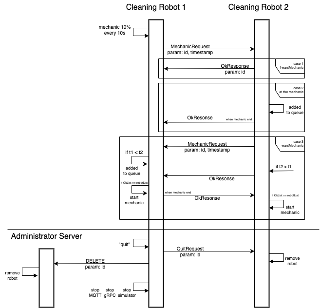

# Distributed and Pervasive Systems final project

**Greenfield** is the final project of **DPS** course held
at Università degli Studi di Milano (2022/2023).

Click [here](Project%20DPS%202023%20-%20Greenfield.pdf) for the project requirements

# Communications schemas
**Initialization**

Sequence of the communications that occur:

* when a new cleaning robot joins Greenfield.

* when the Administrator Client queries the Server for the averages.

**Mechanic steps**

Sequence of the communications that occur:

* when a robot request to use the mechanic (Ricart and Agrawala algorithm).

* when a robot wants to leave Greenfield.

## Author
* [Matteo Rigat](https://github.com/MatteoRigat)

**Teacher** Claudio Bettini

# Tools
* Gradle - Dependency Management
* Intellij - IDE

## License
This project is developed in collaboration with [Università degli Studi di Milano](https://www.unimi.it/).
