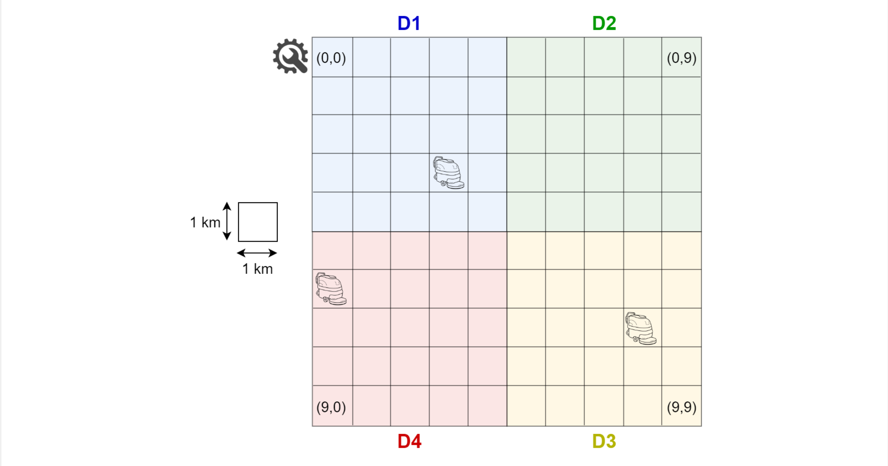
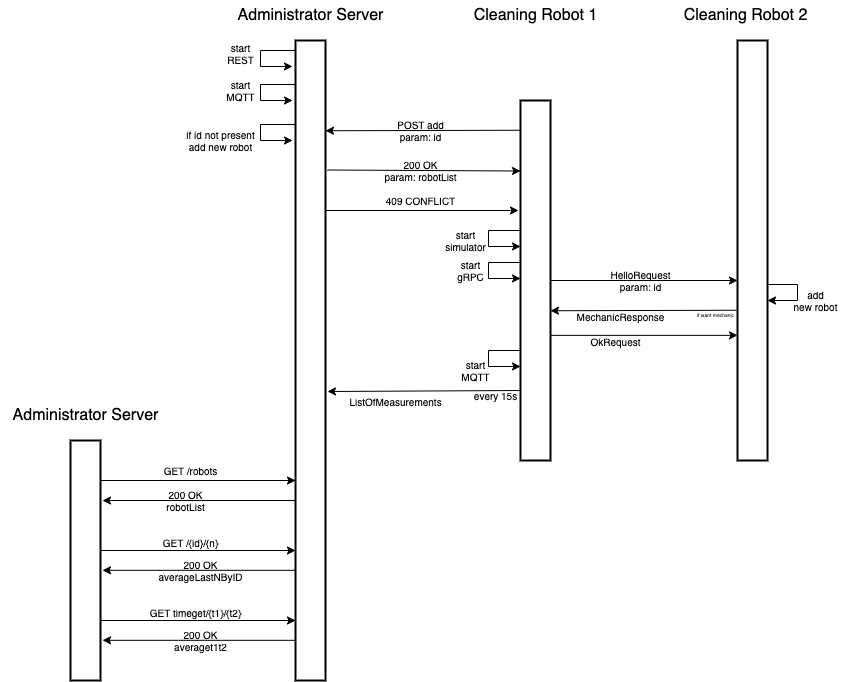

# Distributed and Pervasive Systems final project

**Greenfield** is the final project of **DPS** course held
at Università degli Studi di Milano (2022/2023).

# communications schemas

## Authors
* [Matteo Rigat](https://github.com/MatteoRigat)

**Teacher** Claudio Bettini

# Tools
* Gradle - Dependency Management
* Intellij - IDE

## License
This project is developed in collaboration with [Università degli Studi di Milano](https://www.unimi.it/)
